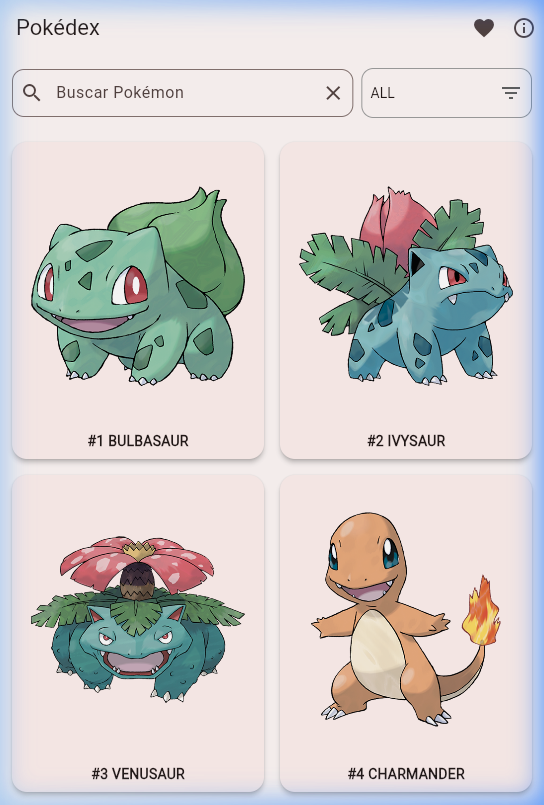
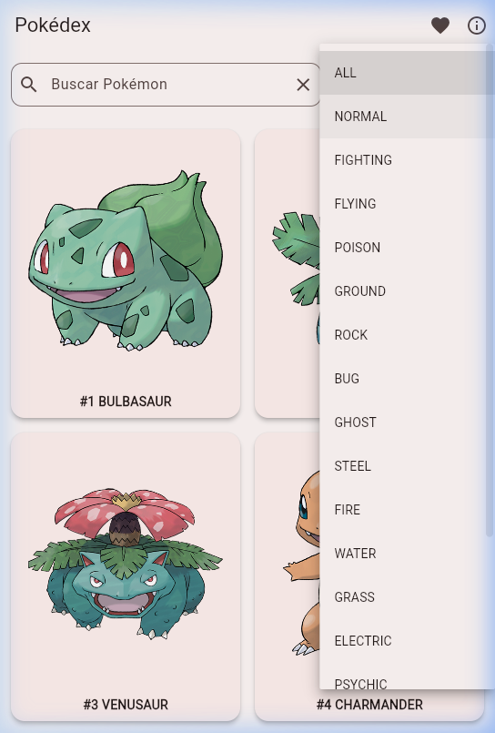
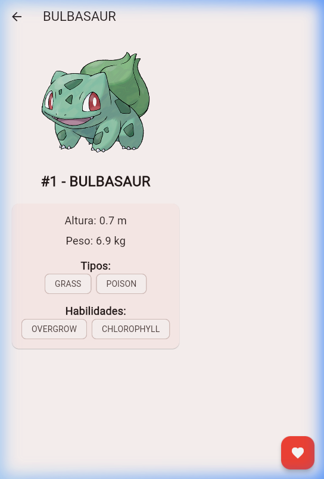
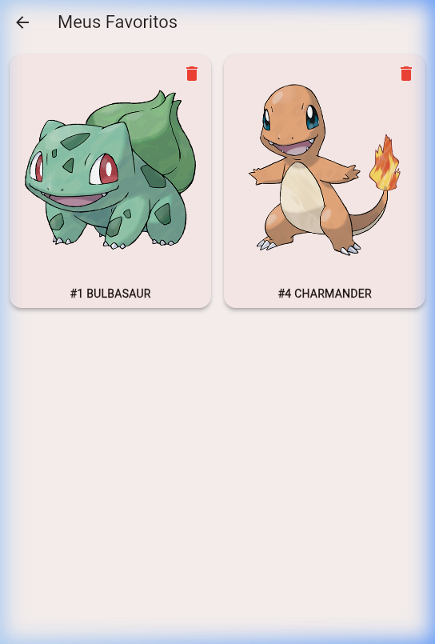

# 📱 Pokédex Flutter Firebase

> Aplicativo mobile de Pokédex desenvolvido com **Flutter**, consumindo a **PokéAPI** e integrando o **Firebase Cloud Firestore** para salvar Pokémons favoritos em tempo real na nuvem.

---

## 📸 Prints da Aplicação

| Tela Principal | Filtro por Tipo | Detalhes | Favoritos |
|---|---|---|---|
|  |  |  |  |

---

## 🌐 Testar o Aplicativo

> 🔗 **[Clique aqui para testar a versão Web do app](https://SEU_LINK_FLUTLAB_AQUI)**

*(Cole o link gerado pelo FlutLab após compilar a versão Web)*

---

## 🎯 Objetivo do Projeto

Desenvolver um aplicativo funcional de Pokédex que demonstre na prática o consumo de uma **API REST externa (PokéAPI)** e a integração com um banco de dados em nuvem (**Firebase Cloud Firestore**), como parte de atividade acadêmica de desenvolvimento mobile com Flutter.

---

## ✨ Funcionalidades

- 📋 **Listagem com rolagem infinita** — carrega 20 Pokémons por vez ao rolar a tela
- 🔍 **Busca por nome ou número** — pesquisa direta na PokéAPI
- 🎨 **Filtro por tipo** — filtra por todos os tipos oficiais (Fogo, Água, Grama, etc.)
- 📄 **Tela de detalhes** — exibe imagem oficial, altura, peso, tipos e habilidades
- ❤️ **Favoritar com Firebase** — salva e remove Pokémons no Firestore em tempo real
- 📡 **Sincronização em tempo real** — tela de favoritos atualiza instantaneamente via `StreamBuilder`
- ℹ️ **Tela Sobre** — informações do projeto e do autor

---

## 🛠️ Tecnologias Utilizadas

| Tecnologia | Versão | Finalidade |
|---|---|---|
| Flutter | >=3.0.0 | Framework de desenvolvimento mobile |
| Dart | >=3.0.0 | Linguagem de programação |
| PokéAPI | v2 | API REST com dados de todos os Pokémons |
| Firebase Core | ^3.0.0 | Inicialização dos serviços Firebase |
| Cloud Firestore | ^5.0.0 | Banco de dados NoSQL em nuvem |
| HTTP | ^1.2.0 | Requisições HTTP para a PokéAPI |
| FlutLab | - | Plataforma de compilação e deploy |

---

## 🏛️ Arquitetura da Aplicação

O projeto segue o padrão de separação em camadas: **Screens → Services → Models**, com comunicação direta com as APIs externas.

```
┌─────────────────────────────────────────────────────────────┐
│                        APLICATIVO                           │
│                                                             │
│  ┌──────────────────────────────────────────────────────┐  │
│  │                    SCREENS (UI)                      │  │
│  │  HomeScreen  │  DetailScreen  │  FavoritesScreen     │  │
│  └────────┬─────────────┬──────────────────┬────────────┘  │
│           │             │                  │               │
│  ┌────────▼─────┐  ┌────▼────────────┐    │               │
│  │   SERVICES   │  │    SERVICES     │    │               │
│  │PokeApiService│  │ FirebaseService │◄───┘               │
│  └────────┬─────┘  └────┬────────────┘                    │
│           │             │                                  │
│  ┌────────▼─────┐  ┌────▼────────────┐                    │
│  │    MODELS    │  │     MODELS      │                    │
│  │ PokemonModel │  │  PokemonModel   │                    │
│  └─────────────┘  └─────────────────┘                    │
│                                                             │
└───────────────┬─────────────────┬───────────────────────────┘
                │                 │
     ┌──────────▼──┐    ┌─────────▼──────────┐
     │  PokéAPI    │    │  Firebase Firestore │
     │  (REST API) │    │  (Cloud Database)  │
     └─────────────┘    └────────────────────┘
```

### Fluxo de Dados

```
Usuário → HomeScreen
          ├── PokeApiService.fetchPokemonList()  → PokéAPI → PokemonModel
          ├── PokeApiService.searchPokemon()     → PokéAPI → PokemonModel
          └── PokeApiService.fetchByType()       → PokéAPI → PokemonModel

Usuário → DetailScreen
          ├── FirebaseService.isFavorite()       → Firestore (leitura)
          ├── FirebaseService.addFavorite()      → Firestore (escrita)
          └── FirebaseService.removeFavorite()   → Firestore (deleção)

Usuário → FavoritesScreen
          └── FirebaseService.getFavorites()     → Firestore (Stream em tempo real)
```

---

## 🗂️ Estrutura do Projeto

```
lib/
├── main.dart                 # Ponto de entrada e inicialização do Firebase
├── app.dart                  # MaterialApp, tema e rotas
├── firebase_options.dart     # Configurações de conexão com o Firebase
│
├── models/
│   └── pokemon_model.dart    # Modelo de dados do Pokémon (fromJson, toMap, fromMap)
│
├── services/
│   ├── pokeapi_service.dart  # Consumo da PokéAPI (lista, busca, tipo)
│   └── firebase_service.dart # CRUD no Firestore (add, remove, get, isFavorite)
│
├── screens/
│   ├── home_screen.dart      # Tela principal com listagem, busca e filtro por tipo
│   ├── detail_screen.dart    # Tela de detalhes do Pokémon com botão de favoritar
│   ├── favorites_screen.dart # Tela de favoritos sincronizados com o Firebase
│   └── about_screen.dart     # Tela sobre o projeto e o autor
│
└── widgets/
    └── pokemon_card.dart     # Widget reutilizável de card do Pokémon
```

---

## ⚙️ Como Instalar e Executar

### Pré-requisitos

- [Flutter SDK](https://flutter.dev/docs/get-started/install) `>=3.0.0` instalado
- [Dart SDK](https://dart.dev/get-dart) `>=3.0.0`
- Conta no [Firebase](https://firebase.google.com/)
- Editor: [VS Code](https://code.visualstudio.com/) ou [Android Studio](https://developer.android.com/studio)

### Passo a Passo

**1. Clone o repositório:**
```bash
git clone https://github.com/SEU_USUARIO/SEU_REPOSITORIO.git
cd SEU_REPOSITORIO
```

**2. Instale as dependências:**
```bash
flutter pub get
```

**3. Execute o aplicativo:**
```bash
# Em um emulador/dispositivo físico Android ou iOS
flutter run

# Para rodar na versão Web
flutter run -d chrome
```

**4. Compilar APK para Android:**
```bash
flutter build apk --release
```
> O APK gerado estará em: `build/app/outputs/flutter-apk/app-release.apk`

---

## 🔥 Configuração do Firebase

O projeto já está configurado com o Firebase no arquivo `lib/firebase_options.dart`.

Para configurar em um novo projeto Firebase:
1. Crie um projeto no [Firebase Console](https://console.firebase.google.com/)
2. Ative o **Cloud Firestore** em modo de teste
3. Execute `flutterfire configure` para gerar o arquivo `firebase_options.dart`

---

## 🌐 Endpoints da PokéAPI Utilizados

| Método | Endpoint | Descrição |
|---|---|---|
| GET | `/pokemon?limit=20&offset=0` | Lista paginada de Pokémons |
| GET | `/pokemon/{id ou nome}` | Detalhes de um Pokémon específico |
| GET | `/type/{tipo}` | Lista de Pokémons de um tipo específico |

---

## 👨‍💻 Autor

**Vinícius Pannuco Ribeiro**

Projeto desenvolvido como atividade acadêmica de desenvolvimento mobile com Flutter e Firebase.
